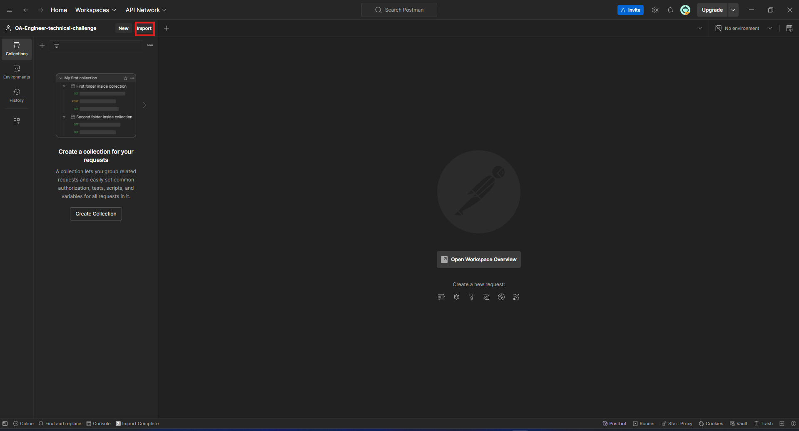
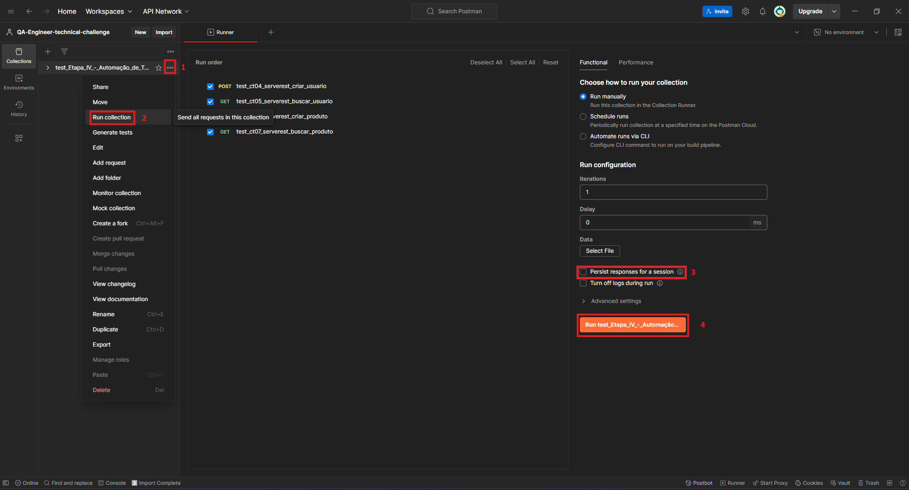
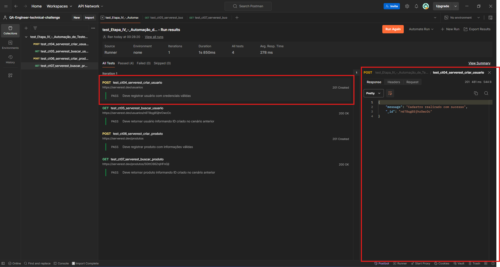

# QA-Engineer-technical-challenge

## Setup

- Para execução das suítes de testes automatizados é necessário que você tenha as seguintes ferramentas instaladas:

  - [Google Chrome](https://www.google.com/intl/pt-BR/chrome/)
  - [Git](https://git-scm.com/downloads)
  - [Python](https://www.python.org/downloads/)
  - [Postman](https://www.postman.com/downloads/)

1. Clone esse repositório usando um terminal com o seguinte comando:

   ```bash
   git clone https://github.com/s4imu/QA-Engineer-technical-challenge.git
   ```

2. Acesse o repositório com o seguinte comando:
   ```bash
   cd QA-Engineer-technical-challenge
   ```
3. Crie o virtual enviroment para os testes que utilizam python com o seguinte comando:

   ```bash
   python -m venv venv
   ```

4. Ative o virtual enviroment com o seguinte comando:
   ```bash
   venv\Scripts\activate
   ```
   uma vez ativado ele deve aparecer com algo parecido no seu terminal:
   ```bash
   (venv) <caminho do diretorio>\QA-Engineer-technical-challenge>
   ```
5. Instale as dependencias do projeto com o seguinte comando:
   ```bash
   pip install -r requirements.txt
   ```

## Execução das Automações

### 2. Etapa II - Automação de Teste Web I

É possível executar a automação desse cenário de teste através do seguinte comando:

```bash
pytest -s -v -m correios ./tests
```

<span style="color: red; font-weight: bold">Obs: Não é preciso pressionar a tecla Enter ou clicar no botão Buscar após preencher o campo do CAPTCHA. Caso uma dessas ações ocorra a automação não será capaz de completar o teste.</span>

### 3. Etapa III - Automação de Teste Web II

É possível executar a automação desse cenário de teste através do seguinte comando:

```bash
pytest -s -v -m trivago ./tests
```

Para verificar as informações que foram solicitadas nesse cenário basta executar o seguinte comando:

```bash
notepad test_ct03_trivago_buscar_por_termo_results.txt
```

### 4. Etapa IV - Automação de Teste de API

- Abra o Postman e importe o **Arquivo:**

  - _test*Etapa_IV*-\_Automação_de_Teste_de_API_serverest.postman_collection.json_

    Dentro do **Diretório:**

  - _Etapa*IV*-\_Automação_de_Teste_de_API_

    Que por sua vez está dentro do **Diretório:** _tests_ no diretório raiz do projeto



- Após a importação:

  1. Clique no menu tres pontos
  2. Clique em Run collection
  3. Clique em Persist responses for a session
  4. Clique em Run test_Etapa_IV...

  Para executar a automação desse cenário:



- Após a execução dos cenários é possível visualizar seus resultados, clicando neles, no próprio Postman como mostra a imagem:



### Os testes automatizados foram desenvolvidos e válidados no seguinte ambiente de testes

|                       |                                                                                                                                                                                                |
| --------------------- | ---------------------------------------------------------------------------------------------------------------------------------------------------------------------------------------------- |
| **Ambiente de teste** | **Desktop**; **Processador:** Intel(R) Core(TM) i3-10100F CPU @ 3.60GHz; **RAM:** 16 GB DDR4 2400hz; **Armazenamento:** SSD ADATA 240GB; **Video:** NVIDIA GeForce GTX 750; **SO:** Windows 11 |
